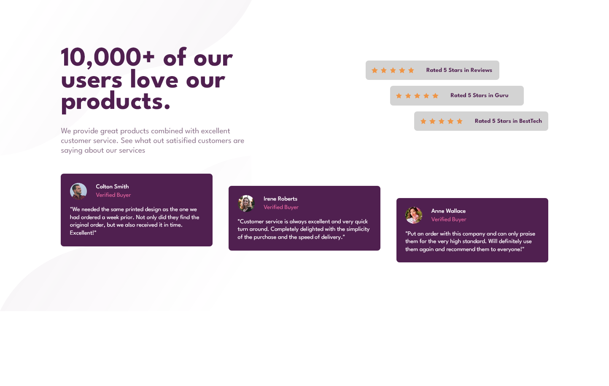
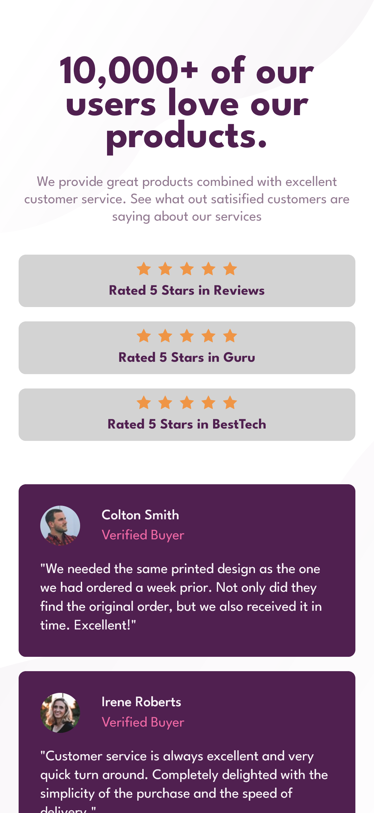

# Frontend Mentor - Social proof section solution

This is a solution to the [Social proof section challenge on Frontend Mentor](https://www.frontendmentor.io/challenges/social-proof-section-6e0qTv_bA). Frontend Mentor challenges help you improve your coding skills by building realistic projects. 

## Table of contents

- [Overview](#overview)
  - [The challenge](#the-challenge)
  - [Screenshot](#screenshot)
  - [Links](#links)
- [My process](#my-process)
  - [Built with](#built-with)
  - [What I learned](#what-i-learned)
  - [Continued development](#continued-development)
  - [Useful resources](#useful-resources)
- [Author](#author)
- [Acknowledgments](#acknowledgments)

## Overview

### The challenge

Users should be able to:

- View the optimal layout for the section depending on their device's screen size

### Screenshots

#### Desktop

#### Mobile

### Links

- Solution URL: [Add solution URL here](https://your-solution-url.com)
- Live Site URL: [Add live site URL here](https://your-live-site-url.com)

## My process

### Built with

- Semantic HTML5 markup
- CSS custom properties
- Flexbox
- Mobile-first workflow

### What I learned

In this challenge I learnt how to use Flexbox to layout elements in a simple and easy way.

### Continued development

I plan to keep taking on more challenges that can be solved using Flexbox to get some more practice.

### Useful resources

- [Conquering Responsive Layouts](https://courses.kevinpowell.co/view/courses/conquering-responsive-layouts) - This course is beginner friendly and It has helped me to overcome some of the initial challenges of using Flexbox.

## Author

- Website - [codedbychavez.com](https://www.codedbychavez.com)
- Frontend Mentor - [@codedbychavez](https://www.frontendmentor.io/profile/codedbychavez)

## Acknowledgments

Hats off to frontendmentor for making this challenges possible, Kevin Powell's course for helping me to understand Flexbox
